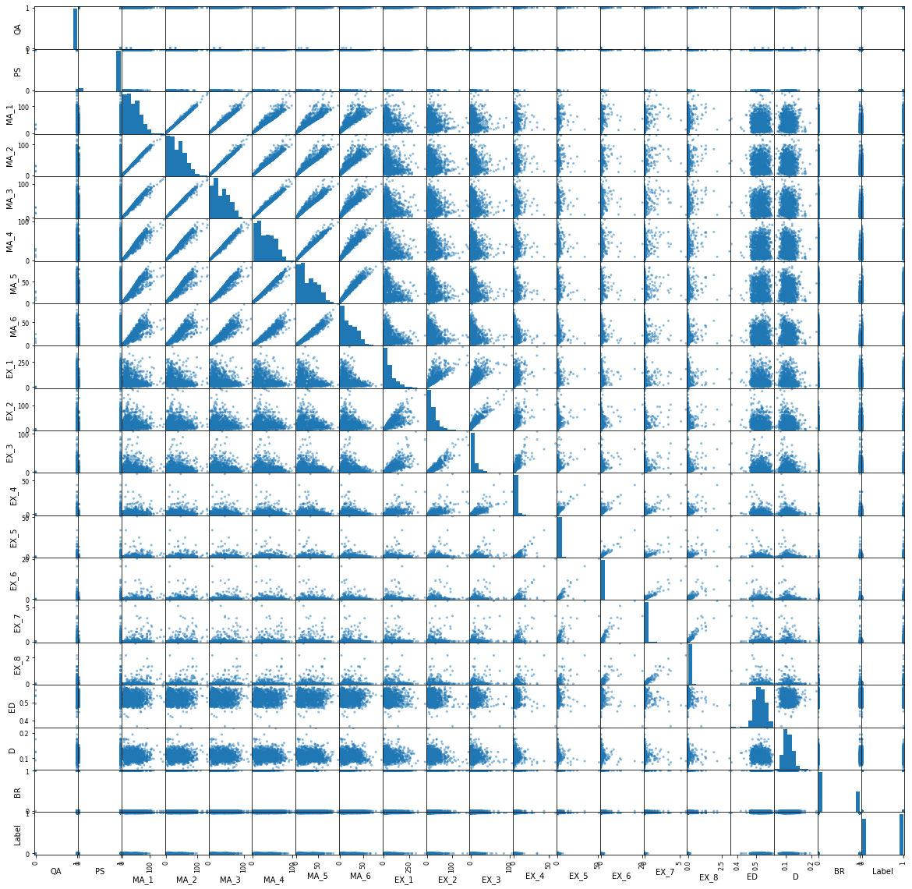
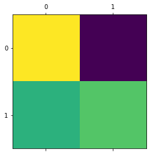
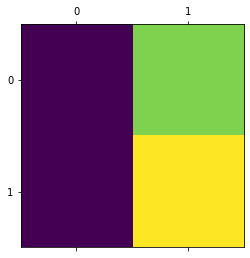
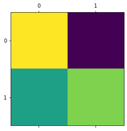

# Diabetic retinopathy 
http://archive.ics.uci.edu/ml/datasets/Diabetic+Retinopathy+Debrecen+Data+Set


#### Imports


```python
import pandas as pd
import scipy.io
import numpy as np
import cv2
from matplotlib import pyplot as plt
```

# Data Pre Processing

### Abstract: This dataset contains features extracted from the Messidor image set to predict whether an image contains signs of diabetic retinopathy or not.


Data Set Characteristics:  Multivariate

Number of Instances: 1151

Area: Life

Attribute Characteristics: Integer, Real

Number of Attributes: 20

Date Donated 2014-11-03

Associated Tasks: Classification

Missing Values: N/A

Number of Web Hits:98721


```python
df = pd.read_csv('messidor_features.csv')
```


```python
df.head()
```


<div>
<style scoped>
    .dataframe tbody tr th:only-of-type {
        vertical-align: middle;
    }

    .dataframe tbody tr th {
        vertical-align: top;
    }

    .dataframe thead th {
        text-align: right;
    }
</style>
<table border="1" class="dataframe">
  <thead>
    <tr style="text-align: right;">
      <th></th>
      <th>attribute1</th>
      <th>attribute2</th>
      <th>attribute3</th>
      <th>attribute4</th>
      <th>attribute5</th>
      <th>attribute6</th>
      <th>attribute7</th>
      <th>attribute8</th>
      <th>attribute9</th>
      <th>attribute10</th>
      <th>attribute11</th>
      <th>attribute12</th>
      <th>attribute13</th>
      <th>attribute14</th>
      <th>attribute15</th>
      <th>attribute16</th>
      <th>attribute17</th>
      <th>attribute18</th>
      <th>attribute19</th>
      <th>attribute20</th>
    </tr>
  </thead>
  <tbody>
    <tr>
      <th>0</th>
      <td>1</td>
      <td>1</td>
      <td>22</td>
      <td>22</td>
      <td>22</td>
      <td>19</td>
      <td>18</td>
      <td>14</td>
      <td>49.895756</td>
      <td>17.775994</td>
      <td>5.270920</td>
      <td>0.771761</td>
      <td>0.018632</td>
      <td>0.006864</td>
      <td>0.003923</td>
      <td>0.003923</td>
      <td>0.486903</td>
      <td>0.100025</td>
      <td>1</td>
      <td>0</td>
    </tr>
    <tr>
      <th>1</th>
      <td>1</td>
      <td>1</td>
      <td>24</td>
      <td>24</td>
      <td>22</td>
      <td>18</td>
      <td>16</td>
      <td>13</td>
      <td>57.709936</td>
      <td>23.799994</td>
      <td>3.325423</td>
      <td>0.234185</td>
      <td>0.003903</td>
      <td>0.003903</td>
      <td>0.003903</td>
      <td>0.003903</td>
      <td>0.520908</td>
      <td>0.144414</td>
      <td>0</td>
      <td>0</td>
    </tr>
    <tr>
      <th>2</th>
      <td>1</td>
      <td>1</td>
      <td>62</td>
      <td>60</td>
      <td>59</td>
      <td>54</td>
      <td>47</td>
      <td>33</td>
      <td>55.831441</td>
      <td>27.993933</td>
      <td>12.687485</td>
      <td>4.852282</td>
      <td>1.393889</td>
      <td>0.373252</td>
      <td>0.041817</td>
      <td>0.007744</td>
      <td>0.530904</td>
      <td>0.128548</td>
      <td>0</td>
      <td>1</td>
    </tr>
    <tr>
      <th>3</th>
      <td>1</td>
      <td>1</td>
      <td>55</td>
      <td>53</td>
      <td>53</td>
      <td>50</td>
      <td>43</td>
      <td>31</td>
      <td>40.467228</td>
      <td>18.445954</td>
      <td>9.118901</td>
      <td>3.079428</td>
      <td>0.840261</td>
      <td>0.272434</td>
      <td>0.007653</td>
      <td>0.001531</td>
      <td>0.483284</td>
      <td>0.114790</td>
      <td>0</td>
      <td>0</td>
    </tr>
    <tr>
      <th>4</th>
      <td>1</td>
      <td>1</td>
      <td>44</td>
      <td>44</td>
      <td>44</td>
      <td>41</td>
      <td>39</td>
      <td>27</td>
      <td>18.026254</td>
      <td>8.570709</td>
      <td>0.410381</td>
      <td>0.000000</td>
      <td>0.000000</td>
      <td>0.000000</td>
      <td>0.000000</td>
      <td>0.000000</td>
      <td>0.475935</td>
      <td>0.123572</td>
      <td>0</td>
      <td>1</td>
    </tr>
  </tbody>
</table>
</div>


### Dataset has 1151 records


```python
df.describe()
```


<div>
<style scoped>
    .dataframe tbody tr th:only-of-type {
        vertical-align: middle;
    }

    .dataframe tbody tr th {
        vertical-align: top;
    }

    .dataframe thead th {
        text-align: right;
    }
</style>
<table border="1" class="dataframe">
  <thead>
    <tr style="text-align: right;">
      <th></th>
      <th>attribute1</th>
      <th>attribute2</th>
      <th>attribute3</th>
      <th>attribute4</th>
      <th>attribute5</th>
      <th>attribute6</th>
      <th>attribute7</th>
      <th>attribute8</th>
      <th>attribute9</th>
      <th>attribute10</th>
      <th>attribute11</th>
      <th>attribute12</th>
      <th>attribute13</th>
      <th>attribute14</th>
      <th>attribute15</th>
      <th>attribute16</th>
      <th>attribute17</th>
      <th>attribute18</th>
      <th>attribute19</th>
      <th>attribute20</th>
    </tr>
  </thead>
  <tbody>
    <tr>
      <th>count</th>
      <td>1151.000000</td>
      <td>1151.000000</td>
      <td>1151.000000</td>
      <td>1151.000000</td>
      <td>1151.000000</td>
      <td>1151.000000</td>
      <td>1151.000000</td>
      <td>1151.000000</td>
      <td>1151.000000</td>
      <td>1151.000000</td>
      <td>1151.000000</td>
      <td>1151.000000</td>
      <td>1151.000000</td>
      <td>1151.000000</td>
      <td>1151.000000</td>
      <td>1151.000000</td>
      <td>1151.000000</td>
      <td>1151.000000</td>
      <td>1151.000000</td>
      <td>1151.000000</td>
    </tr>
    <tr>
      <th>mean</th>
      <td>0.996525</td>
      <td>0.918332</td>
      <td>38.428323</td>
      <td>36.909644</td>
      <td>35.140747</td>
      <td>32.297133</td>
      <td>28.747176</td>
      <td>21.151173</td>
      <td>64.096674</td>
      <td>23.088012</td>
      <td>8.704610</td>
      <td>1.836489</td>
      <td>0.560738</td>
      <td>0.212290</td>
      <td>0.085674</td>
      <td>0.037225</td>
      <td>0.523212</td>
      <td>0.108431</td>
      <td>0.336229</td>
      <td>0.530843</td>
    </tr>
    <tr>
      <th>std</th>
      <td>0.058874</td>
      <td>0.273977</td>
      <td>25.620913</td>
      <td>24.105612</td>
      <td>22.805400</td>
      <td>21.114767</td>
      <td>19.509227</td>
      <td>15.101560</td>
      <td>58.485289</td>
      <td>21.602696</td>
      <td>11.567589</td>
      <td>3.923224</td>
      <td>2.484111</td>
      <td>1.057126</td>
      <td>0.398717</td>
      <td>0.178959</td>
      <td>0.028055</td>
      <td>0.017945</td>
      <td>0.472624</td>
      <td>0.499265</td>
    </tr>
    <tr>
      <th>min</th>
      <td>0.000000</td>
      <td>0.000000</td>
      <td>1.000000</td>
      <td>1.000000</td>
      <td>1.000000</td>
      <td>1.000000</td>
      <td>1.000000</td>
      <td>1.000000</td>
      <td>0.349274</td>
      <td>0.000000</td>
      <td>0.000000</td>
      <td>0.000000</td>
      <td>0.000000</td>
      <td>0.000000</td>
      <td>0.000000</td>
      <td>0.000000</td>
      <td>0.367762</td>
      <td>0.057906</td>
      <td>0.000000</td>
      <td>0.000000</td>
    </tr>
    <tr>
      <th>25%</th>
      <td>1.000000</td>
      <td>1.000000</td>
      <td>16.000000</td>
      <td>16.000000</td>
      <td>15.000000</td>
      <td>14.000000</td>
      <td>11.000000</td>
      <td>8.000000</td>
      <td>22.271597</td>
      <td>7.939315</td>
      <td>1.249050</td>
      <td>0.081554</td>
      <td>0.000000</td>
      <td>0.000000</td>
      <td>0.000000</td>
      <td>0.000000</td>
      <td>0.502855</td>
      <td>0.095799</td>
      <td>0.000000</td>
      <td>0.000000</td>
    </tr>
    <tr>
      <th>50%</th>
      <td>1.000000</td>
      <td>1.000000</td>
      <td>35.000000</td>
      <td>35.000000</td>
      <td>32.000000</td>
      <td>29.000000</td>
      <td>25.000000</td>
      <td>18.000000</td>
      <td>44.249119</td>
      <td>17.038020</td>
      <td>4.423472</td>
      <td>0.484829</td>
      <td>0.022248</td>
      <td>0.001554</td>
      <td>0.000000</td>
      <td>0.000000</td>
      <td>0.523308</td>
      <td>0.106623</td>
      <td>0.000000</td>
      <td>1.000000</td>
    </tr>
    <tr>
      <th>75%</th>
      <td>1.000000</td>
      <td>1.000000</td>
      <td>55.000000</td>
      <td>53.000000</td>
      <td>51.000000</td>
      <td>48.000000</td>
      <td>43.000000</td>
      <td>32.000000</td>
      <td>87.804112</td>
      <td>31.305692</td>
      <td>11.766880</td>
      <td>1.921649</td>
      <td>0.191953</td>
      <td>0.038450</td>
      <td>0.004832</td>
      <td>0.003851</td>
      <td>0.543670</td>
      <td>0.119591</td>
      <td>1.000000</td>
      <td>1.000000</td>
    </tr>
    <tr>
      <th>max</th>
      <td>1.000000</td>
      <td>1.000000</td>
      <td>151.000000</td>
      <td>132.000000</td>
      <td>120.000000</td>
      <td>105.000000</td>
      <td>97.000000</td>
      <td>89.000000</td>
      <td>403.939108</td>
      <td>167.131427</td>
      <td>106.070092</td>
      <td>59.766121</td>
      <td>51.423208</td>
      <td>20.098605</td>
      <td>5.937799</td>
      <td>3.086753</td>
      <td>0.592217</td>
      <td>0.219199</td>
      <td>1.000000</td>
      <td>1.000000</td>
    </tr>
  </tbody>
</table>
</div>


### No missing (N/A values)


```python
df.isnull().sum()
```


    attribute1     0
    attribute2     0
    attribute3     0
    attribute4     0
    attribute5     0
    attribute6     0
    attribute7     0
    attribute8     0
    attribute9     0
    attribute10    0
    attribute11    0
    attribute12    0
    attribute13    0
    attribute14    0
    attribute15    0
    attribute16    0
    attribute17    0
    attribute18    0
    attribute19    0
    attribute20    0
    dtype: int64


## Data set has 20 attributes


```python
attributes = df.columns.values
print("Features : {}".format(attributes))
```

    Features : ['attribute1' 'attribute2' 'attribute3' 'attribute4' 'attribute5'
     'attribute6' 'attribute7' 'attribute8' 'attribute9' 'attribute10'
     'attribute11' 'attribute12' 'attribute13' 'attribute14' 'attribute15'
     'attribute16' 'attribute17' 'attribute18' 'attribute19' 'attribute20']
    

## Attribute Information:

## Features attribute1-attribute19

##### QA
* 1 The binary result of quality assessment. 0 = bad quality 1 = sufficient quality.

#### PS
* 2 The binary result of pre-screening, where 1 indicates severe retinal abnormality and 0 its lack.

#### MA_1 - MA6
* 3-8 The results of MA detection. Each feature value stand for the number of MAs found at the confidence levels alpha = 0.5, . . . , 1, respectively.

#### EX_1 - EX_8
* 9-16 contain the same information as 2-7) for exudates. However, as exudates are represented by a set of points rather than the number of pixels constructing the lesions, these features are normalized by dividing the number of lesions with the diameter of the ROI to compensate different image sizes.

### ED
* 17 The euclidean distance of the center of the macula and the center of the optic disc to provide important information regarding the patients condition. This feature is also normalized with the diameter of the ROI.

#### D
* 18 The diameter of the optic disc.

#### BR
* 19 The binary result of the AM/FM-based classification.


## Label - Attribute20

#### Label
* 20 Class label.
### 1 = contains signs of DR (Accumulative label for the Messidor classes 1, 2, 3)
### 0 = no signs of DR


```python
columns = ["QA", 
           "PS",
           "MA_1", "MA_2", "MA_3", "MA_4", "MA_5", "MA_6",
           "EX_1", "EX_2", "EX_3", "EX_4", "EX_5", "EX_6", "EX_7", "EX_8",
           "ED",
           "D",
           "BR",
           "Label"
]
```


```python
DR_df = pd.DataFrame(df.values, columns=columns)
```


```python
DR_df.head()
```


<div>
<style scoped>
    .dataframe tbody tr th:only-of-type {
        vertical-align: middle;
    }

    .dataframe tbody tr th {
        vertical-align: top;
    }

    .dataframe thead th {
        text-align: right;
    }
</style>
<table border="1" class="dataframe">
  <thead>
    <tr style="text-align: right;">
      <th></th>
      <th>QA</th>
      <th>PS</th>
      <th>MA_1</th>
      <th>MA_2</th>
      <th>MA_3</th>
      <th>MA_4</th>
      <th>MA_5</th>
      <th>MA_6</th>
      <th>EX_1</th>
      <th>EX_2</th>
      <th>EX_3</th>
      <th>EX_4</th>
      <th>EX_5</th>
      <th>EX_6</th>
      <th>EX_7</th>
      <th>EX_8</th>
      <th>ED</th>
      <th>D</th>
      <th>BR</th>
      <th>Label</th>
    </tr>
  </thead>
  <tbody>
    <tr>
      <th>0</th>
      <td>1.0</td>
      <td>1.0</td>
      <td>22.0</td>
      <td>22.0</td>
      <td>22.0</td>
      <td>19.0</td>
      <td>18.0</td>
      <td>14.0</td>
      <td>49.895756</td>
      <td>17.775994</td>
      <td>5.270920</td>
      <td>0.771761</td>
      <td>0.018632</td>
      <td>0.006864</td>
      <td>0.003923</td>
      <td>0.003923</td>
      <td>0.486903</td>
      <td>0.100025</td>
      <td>1.0</td>
      <td>0.0</td>
    </tr>
    <tr>
      <th>1</th>
      <td>1.0</td>
      <td>1.0</td>
      <td>24.0</td>
      <td>24.0</td>
      <td>22.0</td>
      <td>18.0</td>
      <td>16.0</td>
      <td>13.0</td>
      <td>57.709936</td>
      <td>23.799994</td>
      <td>3.325423</td>
      <td>0.234185</td>
      <td>0.003903</td>
      <td>0.003903</td>
      <td>0.003903</td>
      <td>0.003903</td>
      <td>0.520908</td>
      <td>0.144414</td>
      <td>0.0</td>
      <td>0.0</td>
    </tr>
    <tr>
      <th>2</th>
      <td>1.0</td>
      <td>1.0</td>
      <td>62.0</td>
      <td>60.0</td>
      <td>59.0</td>
      <td>54.0</td>
      <td>47.0</td>
      <td>33.0</td>
      <td>55.831441</td>
      <td>27.993933</td>
      <td>12.687485</td>
      <td>4.852282</td>
      <td>1.393889</td>
      <td>0.373252</td>
      <td>0.041817</td>
      <td>0.007744</td>
      <td>0.530904</td>
      <td>0.128548</td>
      <td>0.0</td>
      <td>1.0</td>
    </tr>
    <tr>
      <th>3</th>
      <td>1.0</td>
      <td>1.0</td>
      <td>55.0</td>
      <td>53.0</td>
      <td>53.0</td>
      <td>50.0</td>
      <td>43.0</td>
      <td>31.0</td>
      <td>40.467228</td>
      <td>18.445954</td>
      <td>9.118901</td>
      <td>3.079428</td>
      <td>0.840261</td>
      <td>0.272434</td>
      <td>0.007653</td>
      <td>0.001531</td>
      <td>0.483284</td>
      <td>0.114790</td>
      <td>0.0</td>
      <td>0.0</td>
    </tr>
    <tr>
      <th>4</th>
      <td>1.0</td>
      <td>1.0</td>
      <td>44.0</td>
      <td>44.0</td>
      <td>44.0</td>
      <td>41.0</td>
      <td>39.0</td>
      <td>27.0</td>
      <td>18.026254</td>
      <td>8.570709</td>
      <td>0.410381</td>
      <td>0.000000</td>
      <td>0.000000</td>
      <td>0.000000</td>
      <td>0.000000</td>
      <td>0.000000</td>
      <td>0.475935</td>
      <td>0.123572</td>
      <td>0.0</td>
      <td>1.0</td>
    </tr>
  </tbody>
</table>
</div>


## Checking for correlations


```python
from pandas.plotting import scatter_matrix
scatter_matrix(DR_df, figsize=(20, 20))
plt.show()
```





#### Let's check what is the most correlated feature for our label


```python
corr_matrix = DR_df.corr()
corr_matrix["Label"].sort_values(ascending=False)
```


    Label    1.000000
    MA_1     0.292603
    MA_2     0.266338
    MA_3     0.234691
    MA_4     0.197511
    EX_7     0.184772
    EX_8     0.177313
    MA_5     0.161631
    EX_6     0.151424
    EX_5     0.142273
    MA_6     0.127861
    EX_4     0.104254
    QA       0.062816
    EX_1     0.058015
    EX_3     0.038281
    ED       0.008466
    EX_2     0.000479
    D       -0.030868
    BR      -0.042144
    PS      -0.076925
    Name: Label, dtype: float64


## According to correlation analysis MA_1 has the most correlation value but it is also less than 0.3000 

### Let's check average of MA values


```python
DR_df["MA_AVG"] = (DR_df["MA_1"] + DR_df["MA_2"] + DR_df["MA_3"]) / 3
```


```python
corr_matrix = DR_df.corr()
corr_matrix["Label"].sort_values(ascending=False)
```


    Label     1.000000
    MA_1      0.292603
    MA_AVG    0.266369
    MA_2      0.266338
    MA_3      0.234691
    MA_4      0.197511
    EX_7      0.184772
    EX_8      0.177313
    MA_5      0.161631
    EX_6      0.151424
    EX_5      0.142273
    MA_6      0.127861
    EX_4      0.104254
    QA        0.062816
    EX_1      0.058015
    EX_3      0.038281
    ED        0.008466
    EX_2      0.000479
    D        -0.030868
    BR       -0.042144
    PS       -0.076925
    Name: Label, dtype: float64


#### Average MA does not improve the correlation 

## Since all MA values has correlations we can use only MA_1 because it has the highest corretion with Label

## Check the average of All EX values


```python
DR_df["EX_AVG"] = ( DR_df["EX_6"] + DR_df["EX_7"] + DR_df["EX_8"]) / 8
```


```python
corr_matrix = DR_df.corr()
corr_matrix["Label"].sort_values(ascending=False)
```


    Label     1.000000
    MA_1      0.292603
    MA_AVG    0.266369
    MA_2      0.266338
    MA_3      0.234691
    MA_4      0.197511
    EX_7      0.184772
    EX_8      0.177313
    EX_AVG    0.167797
    MA_5      0.161631
    EX_6      0.151424
    EX_5      0.142273
    MA_6      0.127861
    EX_4      0.104254
    QA        0.062816
    EX_1      0.058015
    EX_3      0.038281
    ED        0.008466
    EX_2      0.000479
    D        -0.030868
    BR       -0.042144
    PS       -0.076925
    Name: Label, dtype: float64


###### The most relevent feature is EX_7 

## Spliting the datset


```python
DR_df = DR_df.drop("EX_AVG", axis=1)
DR_df = DR_df.drop("MA_AVG", axis=1)
```


```python
X = DR_df.drop("Label", axis=1)
y = DR_df["Label"]
```


```python
from sklearn.model_selection import train_test_split
X_train, X_test, y_train, y_test = train_test_split(X, y, test_size=0.2, random_state=42)
```

# Scaling the dataset


```python
from sklearn.preprocessing import StandardScaler
scaler = StandardScaler()
X_train_scaled = scaler.fit_transform(X_train)
X_test_scaled = scaler.fit_transform(X_test)
```

# Trainig and Validation


```python
from sklearn.svm import SVC
from sklearn.linear_model import SGDClassifier

from sklearn.neural_network import MLPClassifier
from sklearn.neighbors import KNeighborsClassifier

from sklearn.gaussian_process import GaussianProcessClassifier
from sklearn.gaussian_process.kernels import RBF
from sklearn.tree import DecisionTreeClassifier
from sklearn.ensemble import RandomForestClassifier


from sklearn.metrics import accuracy_score
from sklearn.model_selection import cross_val_score #For testing Accuracy
from sklearn.metrics import confusion_matrix
from sklearn.metrics import precision_score, recall_score
```


```python
def get_predicitons(clf, X_train=X_train, y_train=y_train, X_test=X_test, y_test=y_test):
    clf.fit(X_train, y_train)
    clf_predict = svc_clf.predict(X_test)
    clf_acore = accuracy_score(y_test, clf_predict)
    rs = recall_score(y_test, clf_predict)
    ps = precision_score(y_test, clf_predict)
    
    print("Accuracy        = {:2f}%".format(clf_acore * 100)) #Accuracy For without setting any hiperparameter manually
    print("Recall Score    = {:2f}".format(rs))
    print("Precision Score = {:2f}".format(ps))
    
    
    #Confusion Metrix
    print("Confusion Matrix...\n")
    
    q = confusion_matrix(y_test, clf_predict)
    print(q)
    plt.matshow(q)
    plt.show()
    
    return clf_acore, rs, ps
    
    
```


```python
def get_predictions_advanced(clf, scaled=False):
    if scaled:
        get_predicitons(clf, X_train=X_train_scaled, X_test=X_test_scaled)
    else:
        get_predicitons(clf)
```


```python
def get_all_predictions(clf):
    print("Classifier for non Scaled features......\n")
    get_predictions_advanced(clf)
    
    print("Classifier for Scaled features..........\n")
    get_predictions_advanced(clf, scaled=True)
    
```

## SVC 


```python
svc_clf = SVC()
get_all_predictions(svc_clf)
```

    Classifier for non Scaled features......
    
    Accuracy        = 65.800866%
    Recall Score    = 0.523438
    Precision Score = 0.788235
    Confusion Matrix...
    
    [[85 18]
     [61 67]]
    





    Classifier for Scaled features..........
    
    Accuracy        = 67.965368%
    Recall Score    = 0.562500
    Precision Score = 0.800000
    Confusion Matrix...
    
    [[85 18]
     [56 72]]
    


### So we can clearly see an improvement when the features are scaled

### Changing the Hiperparameters


```python
svc_clf_1 = SVC(gamma='scale')
get_all_predictions(svc_clf_1)
```

    Classifier for non Scaled features......
    
    Accuracy        = 55.411255%
    Recall Score    = 1.000000
    Precision Score = 0.554113
    Confusion Matrix...
    
    [[  0 103]
     [  0 128]]
    


    Classifier for Scaled features..........
    
    Accuracy        = 67.965368%
    Recall Score    = 0.562500
    Precision Score = 0.800000
    Confusion Matrix...
    
    [[85 18]
     [56 72]]
    


### Changing Kernel


```python
svc_clf_2 = SVC(kernel="poly")
get_all_predictions(svc_clf_2)
```

    Classifier for non Scaled features......
    
    Accuracy        = 55.411255%
    Recall Score    = 1.000000
    Precision Score = 0.554113
    Confusion Matrix...
    
    [[  0 103]
     [  0 128]]
    





    Classifier for Scaled features..........
    
    Accuracy        = 67.965368%
    Recall Score    = 0.562500
    Precision Score = 0.800000
    Confusion Matrix...
    
    [[85 18]
     [56 72]]
    





## Linear Classifier


```python
sgd_clf = SGDClassifier()
get_all_predictions(sgd_clf)
```

    Classifier for non Scaled features......
    
    Accuracy        = 55.411255%
    Recall Score    = 1.000000
    Precision Score = 0.554113
    Confusion Matrix...
    
    [[  0 103]
     [  0 128]]
    


    Classifier for Scaled features..........
    
    Accuracy        = 67.965368%
    Recall Score    = 0.562500
    Precision Score = 0.800000
    Confusion Matrix...
    
    [[85 18]
     [56 72]]
    


### KNeighborsClassifier


```python
clf = KNeighborsClassifier()
get_all_predictions(clf)
```

    Classifier for non Scaled features......
    
    Accuracy        = 55.411255%
    Recall Score    = 1.000000
    Precision Score = 0.554113
    Confusion Matrix...
    
    [[  0 103]
     [  0 128]]
    


    Classifier for Scaled features..........
    
    Accuracy        = 67.965368%
    Recall Score    = 0.562500
    Precision Score = 0.800000
    Confusion Matrix...
    
    [[85 18]
     [56 72]]
    


### MLPClassifier


```python
clf = MLPClassifier(alpha=1, max_iter=1000)
get_all_predictions(clf)
```

    Classifier for non Scaled features......
    
    Accuracy        = 55.411255%
    Recall Score    = 1.000000
    Precision Score = 0.554113
    Confusion Matrix...
    
    [[  0 103]
     [  0 128]]
    


    Classifier for Scaled features..........
    
    Accuracy        = 67.965368%
    Recall Score    = 0.562500
    Precision Score = 0.800000
    Confusion Matrix...
    
    [[85 18]
     [56 72]]
    


### GaussianProcessClassifier


```python
sgd_clf = GaussianProcessClassifier()
get_all_predictions(sgd_clf)
```

    Classifier for non Scaled features......
    
    Accuracy        = 55.411255%
    Recall Score    = 1.000000
    Precision Score = 0.554113
    Confusion Matrix...
    
    [[  0 103]
     [  0 128]]
    


    Classifier for Scaled features..........
    
    Accuracy        = 67.965368%
    Recall Score    = 0.562500
    Precision Score = 0.800000
    Confusion Matrix...
    
    [[85 18]
     [56 72]]
    


### DecisionTreeClassifier


```python
sgd_clf = DecisionTreeClassifier(max_depth=5)
get_all_predictions(sgd_clf)
```

    Classifier for non Scaled features......
    
    Accuracy        = 55.411255%
    Recall Score    = 1.000000
    Precision Score = 0.554113
    Confusion Matrix...
    
    [[  0 103]
     [  0 128]]
    


    Classifier for Scaled features..........
    
    Accuracy        = 67.965368%
    Recall Score    = 0.562500
    Precision Score = 0.800000
    Confusion Matrix...
    
    [[85 18]
     [56 72]]
    


### RandomForestClassifier


```python
sgd_clf = RandomForestClassifier(max_depth=5, n_estimators=10, max_features=1)
get_all_predictions(sgd_clf)    
```

    Classifier for non Scaled features......
    
    Accuracy        = 55.411255%
    Recall Score    = 1.000000
    Precision Score = 0.554113
    Confusion Matrix...
    
    [[  0 103]
     [  0 128]]
    


    Classifier for Scaled features..........
    
    Accuracy        = 67.965368%
    Recall Score    = 0.562500
    Precision Score = 0.800000
    Confusion Matrix...
    
    [[85 18]
     [56 72]]
    


```python
########################## END ####################################################
```
